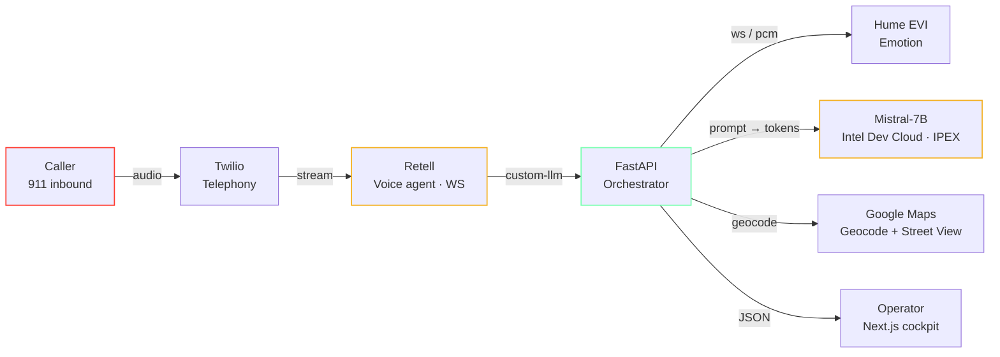

<div align="center">


# DispatchAI

### An empathetic AI dispatcher for 911 — real-time transcripts, emotion-aware triage, and a live operator cockpit.

<a href="https://dispatchai.art3m1s.me"></a>
<a href="https://www.youtube.com/watch?v=hdpdgxrilQM"></a>
<a href="https://devpost.com/software/dispatch-ai"></a>

<br/>

<a href="https://dispatchai.art3m1s.me">
  
</a>

<br/>
<br/>

<!-- Stack chips -->

<a href="https://nextjs.org"></a>
<a href="https://www.typescriptlang.org"></a>
<a href="https://tailwindcss.com"></a>
<a href="https://fastapi.tiangolo.com"></a>
<a href="https://www.python.org"></a>
<a href="https://www.prisma.io"></a>
<a href="https://www.postgresql.org"></a>
<a href="https://www.retellai.com"></a>
<a href="https://www.twilio.com"></a>
<a href="https://hume.ai"></a>
<a href="https://huggingface.co/spikecodes/ai-911-operator"></a>
<a href="https://cloud.google.com/run"></a>
<a href="https://clerk.com"></a>

</div>

---

<!-- Stats strip -->

<table align="center" width="100%">
  <tr align="center">
    <td><h3>36 hr</h3><sub>build time</sub></td>
    <td><h3>$64k</h3><sub>prizes won</sub></td>
    <td><h3>3×</h3><sub>awards won</sub></td>
    <td><h3>4</h3><sub>builders</sub></td>
    <td><h3>518</h3><sub>open transcripts</sub></td>
    <td><h3>1st of 293</h3><sub>at Cal Hacks AI</sub></td>
  </tr>
</table>

---

## ▶ Watch the demo

<div align="center">

<a href="https://www.youtube.com/watch?v=hdpdgxrilQM" title="Watch the DispatchAI demo on YouTube">
  
</a>

<br/>

<a href="https://www.youtube.com/watch?v=hdpdgxrilQM"></a>

<sub><i>Submission video shown to the panel — full call: 911 inbound&nbsp;→&nbsp;Twilio&nbsp;→&nbsp;Retell&nbsp;→&nbsp;FastAPI&nbsp;→&nbsp;Mistral, surfacing transcript, emotion, and dossier in the cockpit.</i></sub>

</div>

---

## TL;DR

- **What.** A 911 dispatcher copilot. A caller phones a Twilio number, a **Retell** voice agent (running our custom LLM over websocket) handles the conversation while a fine-tuned **Mistral-7B** drafts incident reports and **Hume EVI** tracks the caller's emotional state. A Next.js operator cockpit shows the live transcript, severity-coded map pin, AI summary, and Street View — with a human dispatcher always in the loop on the actual response.
- **Why.** US 911 systems lose ~80% of staff within a year and are 30% understaffed. The agent does the parts a human shouldn't have to do at 3 a.m. — listen calmly to a panicking caller, type their address, score severity, and hand the human a tight, factual brief.
- **How fast.** 36 hours, 4 people, on-site at the **UC Berkeley AI Hackathon (Cal Hacks AI 2024)** — 930 builders, 293 submissions.
- **Result.** **Grand prize** + AI For Good (by AIC) + Best Use of Intel AI — a $25k Berkeley SkyDeck Fund investment plus a Golden Ticket to SkyDeck Pad-13.

## 🏆 Awards

<table>
  <thead>
    <tr><th align="left">Award</th><th align="left">Sponsor / Track</th></tr>
  </thead>
  <tbody>
    <tr><td><b>Grand Prize</b></td><td>UC Berkeley AI Hackathon 2024 · $25k Berkeley SkyDeck Fund investment + Golden Ticket to SkyDeck Pad-13</td></tr>
    <tr><td><b>AI For Good</b></td><td>Academic Innovation Catalyst (AIC)</td></tr>
    <tr><td><b>Best Use of Intel AI</b></td><td>Intel</td></tr>
  </tbody>
</table>

## 🔗 Live links & open-source artifacts

<table>
  <tr>
    <td>🌐&nbsp;<a href="https://dispatchai.art3m1s.me"><b>Live deployment / case study</b></a></td>
    <td><sub>dispatchai.art3m1s.me</sub></td>
  </tr>
  <tr>
    <td>📝&nbsp;<a href="https://devpost.com/software/dispatch-ai"><b>Devpost submission</b></a></td>
    <td><sub>60 likes · 5 comments · grand prize</sub></td>
  </tr>
  <tr>
    <td>🎥&nbsp;<a href="https://www.youtube.com/watch?v=hdpdgxrilQM"><b>3-minute demo</b></a></td>
    <td><sub>The full panel submission video</sub></td>
  </tr>
  <tr>
    <td>🤖&nbsp;<a href="https://huggingface.co/spikecodes/ai-911-operator"><b>Open-source model</b></a></td>
    <td><sub>Mistral-7B LoRA · MIT · trained on Intel Dev Cloud</sub></td>
  </tr>
  <tr>
    <td>📚&nbsp;<a href="https://huggingface.co/datasets/spikecodes/911-call-transcripts"><b>Open-source dataset</b></a></td>
    <td><sub>518 dispatcher transcripts · public snapshot</sub></td>
  </tr>
  <tr>
    <td>🎨&nbsp;<a href="./Design.md"><b>Design language doc</b></a></td>
    <td><sub>Type system, color tokens, motion, component catalog</sub></td>
  </tr>
  <tr>
    <td>🖼️&nbsp;<a href="https://www.figma.com/design/wCSONTXVKHb5pBLcnex7OZ/Dispatch-AI?node-id=100-2294"><b>Original Figma file</b></a></td>
    <td><sub>The hackathon design artifact</sub></td>
  </tr>
</table>

## ✨ What it does

<table>
  <tr>
    <td valign="top" width="50%">

### 📞 Real-time call handling
Twilio&nbsp;→&nbsp;Retell websocket&nbsp;→&nbsp;custom LLM at FastAPI <code>/retell/llm-websocket/{call_id}</code>. Sub-second response latency on the conversational loop.
    </td>
    <td valign="top" width="50%">

### 💛 Empathy as a first-class signal
Hume EVI emotion telemetry feeds the LLM context window so wording calibrates to the caller's distress, not just their words.
    </td>
  </tr>
  <tr>
    <td valign="top" width="50%">

### 🧠 AI-assisted, human-dispatched
A fine-tuned Mistral-7B on Intel Dev Cloud drafts severity, title, summary, and recommendation. The dispatcher accepts, edits, or rejects — the AI never closes the loop.
    </td>
    <td valign="top" width="50%">

### 🗺️ Operator cockpit
Severity-coded incident queue, MapTiler map with synced pins, live transcript, caller emotion gauge, and pre-baked Google Street View — assembled from a single FastAPI orchestrator on 5 s polling.
    </td>
  </tr>
</table>

## 🏗 Architecture



The caller reaches Twilio; Retell runs the voice agent over a websocket against the FastAPI orchestrator. FastAPI streams audio to Hume EVI for emotion, prompts the Mistral-7B LoRA on Intel Dev Cloud, and pushes geocoded incidents to the Next.js operator cockpit. A human dispatcher remains the final authority on dispatch.

<details>
<summary><b>End-to-end call flow (7 steps)</b></summary>

1. Retell connects to <code>/retell/llm-websocket/{call_id}</code>.
2. The backend receives <code>call_details</code>, finds the registered user, creates a <code>Call</code>, and creates an empty <code>CallAnalytics</code> row.
3. Retell sends transcript updates through websocket messages.
4. The backend responds to the caller immediately, then runs analytics in the background.
5. Analytics updates <code>CallAnalytics</code> with severity, title, summary, recommendation, location, latitude, longitude, and Street View data when available.
6. The frontend polls <code>/api/calls</code> and reflects active call analytics on the dashboard map and detail panels.
7. The Retell webhook handles lifecycle events, especially <code>call_ended</code>, as a backup source of truth for resolving calls.

</details>

## 🧰 Stack

<table>
  <tr><th align="left">Layer</th><th align="left">Tools</th></tr>
  <tr>
    <td>Telephony</td>
    <td>Twilio (inbound PSTN) · Retell (voice agent + websocket transport)</td>
  </tr>
  <tr>
    <td>Realtime LLM</td>
    <td>Custom LLM endpoint over websocket (<code>/retell/llm-websocket/{call_id}</code>)</td>
  </tr>
  <tr>
    <td>Inference</td>
    <td>Fine-tuned <b>Mistral 7B (LoRA)</b> on <b>Intel Dev Cloud</b> with IPEX-LLM</td>
  </tr>
  <tr>
    <td>Emotion</td>
    <td><b>Hume EVI</b> — streaming emotion telemetry</td>
  </tr>
  <tr>
    <td>Orchestrator</td>
    <td><b>FastAPI</b> + <b>Prisma (Python)</b> + <b>PostgreSQL</b></td>
  </tr>
  <tr>
    <td>Frontend</td>
    <td><b>Next.js 16</b> (App Router) · <b>TypeScript</b> · <b>TailwindCSS</b> · <b>shadcn/ui</b> · <b>Framer Motion</b> · <b>MapTiler / Leaflet</b></td>
  </tr>
  <tr>
    <td>Auth</td>
    <td><b>Clerk</b> with phone-based dispatcher routing</td>
  </tr>
  <tr>
    <td>Maps & geocoding</td>
    <td>Google Maps API + Street View</td>
  </tr>
  <tr>
    <td>Hosting</td>
    <td>Backend on <b>Google Cloud Run</b> (<code>us-west1</code>) · frontend on <b>Vercel</b></td>
  </tr>
  <tr>
    <td>Dev tooling</td>
    <td>Playwright MCP · React Grab MCP · Mermaid for system diagrams</td>
  </tr>
</table>

## 🗂 Repository layout

```
.
├── client/                 # Next.js frontend (operator cockpit + portfolio case study)
│   ├── src/app/            # App Router routes; (layout) wraps the authed cockpit
│   ├── src/components/     # case-study/, dashboard/, header/, sidebar/, shared/, brand/
│   └── public/             # Static assets, team photos, pre-baked Street View
├── server/                 # FastAPI backend
│   ├── retell/             # Custom LLM websocket + Retell webhook
│   ├── analytics/          # Severity / title / summary / recommendation extraction
│   ├── geocoding/          # Google Maps + Street View
│   └── scripts/            # One-off ops scripts
├── prisma/                 # Shared Prisma schema (PostgreSQL)
├── intel_dev_cloud/        # Mistral-7B fine-tuning notebooks for Intel Dev Cloud
├── Dockerfile              # Cloud Run backend image
├── Design.md               # Full design language documentation
└── dispatch-ai-berkeley-hackathon-2024(-research).{json,md}
                            # Underlying research artifacts for the case study
```

## 👥 Team

<table>
  <tr>
    <td align="center" valign="top" width="25%">
      
      <br/>
      <h4>Jasmine Wu</h4>
      <sub><i>Mistral fine-tune · voice backend · UX</i></sub>
      <br/><br/>
      <a href="https://www.linkedin.com/in/jaslavie/">LinkedIn ↗</a>
      <br/><br/>
      <sub align="left">Started the project, solo-pitched the finalist demo, fine-tuned Mistral on real 911 transcripts, built the voice backend, and shaped the human-AI handoff working with real dispatchers.</sub>
    </td>
    <td align="center" valign="top" width="25%">
      
      <br/>
      <h4>Spike O'Carroll</h4>
      <sub><i>ML · Backend</i></sub>
      <br/><br/>
      <a href="https://github.com/spikecodes">@spikecodes</a> · <a href="https://www.linkedin.com/in/spike-ocarroll/">LinkedIn ↗</a>
      <br/><br/>
      <sub align="left">Led ML and backend. Hume EVI, Twilio, extraction + eval pipelines. Ran the LoRA fine-tune on Intel Dev Cloud and authored the open-sourced model + dataset on Hugging Face.</sub>
    </td>
    <td align="center" valign="top" width="25%">
      
      <br/>
      <h4>Kevin Wu</h4>
      <sub><i>Frontend · UX · Product</i></sub>
      <br/><br/>
      <a href="https://www.linkedin.com/in/kevinwu098/">LinkedIn ↗</a>
      <br/><br/>
      <sub align="left">Owned the operator dashboard end-to-end. Real-time interactive cockpit in Next.js + TailwindCSS with a focus on calm, dispatcher-grade interactions under load.</sub>
    </td>
    <td align="center" valign="top" width="25%">
      
      <br/>
      <h4>Bill Zhang ⭐</h4>
      <sub><i>Conversational AI · Voice agent · portfolio cut</i></sub>
      <br/><br/>
      <a href="https://github.com/IdkwhatImD0ing">@IdkwhatImD0ing</a> · <a href="https://www.linkedin.com/in/bill-zhang1/">LinkedIn ↗</a>
      <br/><br/>
      <sub align="left">Built the conversational layer and voice agent runtime. Integrated the LLM into the live call loop and stitched the real-time interactive cockpit. Authored the portfolio cut at <a href="https://dispatchai.art3m1s.me">dispatchai.art3m1s.me</a>.</sub>
    </td>
  </tr>
</table>

## ⚖️ Build context & tradeoffs

This was a 36-hour build, not a shipping product. The full discussion lives in the [case study](https://dispatchai.art3m1s.me/#tradeoffs); the headlines:

- **Dataset is small.** 518 transcripts, demographically uneven. Real deployment requires demographic-stratified evals against accents, dialects, and forms of distress not represented in 518 rows or in Hume's emotion model.
- **Assist-only by construction.** Recommendations carry a confidence score; the dispatcher accepts, edits, or rejects. No outbound dispatch is initiated by the AI.
- **PSAPs are hard to sell.** NENA / CJIS / SOC 2 alignment, integrations with legacy CAD and i3 NG911, 6–18 month sales cycles. The hackathon scope was deliberately a credible prototype, not a procurement-ready product.

The portfolio cut at [dispatchai.art3m1s.me](https://dispatchai.art3m1s.me) wraps the original system in a long-form case study — every page and feature still works; recruiters just don't have to sign in to see the cockpit (an embedded non-interactive replica is rendered on the case study page itself).

---

<details>
<summary><b>🛠 Running it locally / operations notes</b></summary>

### Backend runtime

The backend entrypoint is `server.main:app`.

```bash
uvicorn server.main:app --reload
```

Production runs on Google Cloud Run:

- Project: `spiritual-storm-469704-n2`
- Service: `dispatch`
- Region: `us-west1`
- Base URL: `https://dispatch-815644024160.us-west1.run.app`
- Cloud Run `status.url` alias: `https://dispatch-kkvf2gesjq-uw.a.run.app`
- Retell webhook: `https://dispatch-815644024160.us-west1.run.app/retell/webhook`
- Retell custom LLM websocket: `wss://dispatch-815644024160.us-west1.run.app/retell/llm-websocket`

### Required backend environment

Set these on Cloud Run before handling live calls:

- `DATABASE_URL`
- `OPENAI_API_KEY`
- `RETELL_API_KEY`
- `RETELL_AGENT_ID`
- `RETELL_PHONE_NUMBER`
- `RETELL_WEBHOOK_SECRET`
- `GOOGLE_API_KEY`
- `HUME_API_KEY`

Do not commit `.env` files. `.gcloudignore` excludes local environment files from source deploys.

To sync the local `server/.env` values into Cloud Run from PowerShell:

```powershell
$vars = @{}
Get-Content "server/.env" | ForEach-Object {
  if ($_ -match '^\s*([^#=]+)=(.*)$') {
    $key = $matches[1].Trim()
    $value = $matches[2].Trim().Trim('"')
    $vars[$key] = $value
  }
}

$envArg = '^|^DATABASE_URL=' + $vars['DATABASE_URL'] +
  '|OPENAI_API_KEY=' + $vars['OPENAI_API_KEY'] +
  '|RETELL_API_KEY=' + $vars['RETELL_API_KEY'] +
  '|RETELL_AGENT_ID=' + $vars['RETELL_AGENT_ID'] +
  '|RETELL_PHONE_NUMBER=' + $vars['RETELL_PHONE_NUMBER'] +
  '|RETELL_WEBHOOK_SECRET=' + $vars['RETELL_WEBHOOK_SECRET'] +
  '|GOOGLE_API_KEY=' + $vars['GOOGLE_API_KEY'] +
  '|HUME_API_KEY=' + $vars['HUME_API_KEY']

gcloud run services update dispatch `
  --project spiritual-storm-469704-n2 `
  --region us-west1 `
  --platform managed `
  --update-env-vars $envArg
```

The custom `^|^` delimiter avoids parsing failures for values that contain characters such as `&`.

### Deploy backend

Deploy from the repository root:

```bash
gcloud run deploy dispatch \
  --source . \
  --project spiritual-storm-469704-n2 \
  --region us-west1 \
  --platform managed \
  --allow-unauthenticated
```

The deploy uses:

- `Dockerfile` for the backend image.
- `.gcloudignore` to exclude the frontend, local virtualenvs, and secrets.
- Existing Cloud Run environment variables unless explicitly changed.

After deploy, verify the service:

```bash
gcloud run services describe dispatch \
  --project spiritual-storm-469704-n2 \
  --region us-west1 \
  --format="value(status.url,status.latestReadyRevisionName)"
```

The deploy command may print the canonical project-number URL (`https://dispatch-815644024160.us-west1.run.app`) while `status.url` may return the older `a.run.app` alias. Both route to the same Cloud Run service; Retell is configured to the canonical project-number URL.

### Retell agent configuration

The Retell agent should point to the Cloud Run backend, not an ngrok or Koyeb URL.

Use the SDK update shape below when changing the backend URL:

```python
import os
from dotenv import load_dotenv
from retell import Retell

load_dotenv("server/.env")

base_url = "https://dispatch-815644024160.us-west1.run.app"
websocket_url = base_url.replace("https://", "wss://") + "/retell/llm-websocket"
webhook_url = base_url + "/retell/webhook"

client = Retell(api_key=os.environ["RETELL_API_KEY"])
client.agent.update(
    os.environ["RETELL_AGENT_ID"],
    webhook_url=webhook_url,
    extra_body={
        "response_engine": {
            "type": "custom-llm",
            "llm_websocket_url": websocket_url,
        }
    },
)
```

Then confirm:

```python
agent = client.agent.retrieve(os.environ["RETELL_AGENT_ID"])
print(agent.response_engine)
print(agent.webhook_url)
```

Expected values:

- `response_engine.llm_websocket_url`: `wss://dispatch-815644024160.us-west1.run.app/retell/llm-websocket`
- `webhook_url`: `https://dispatch-815644024160.us-west1.run.app/retell/webhook`

</details>

<div align="center">
<br/>
<sub>Built in 36 hours at the UC Berkeley AI Hackathon · June 22–23, 2024 · Awarded grand prize among 293 submissions.</sub>
<br/>
<sub><a href="https://dispatchai.art3m1s.me">dispatchai.art3m1s.me</a> · <a href="https://github.com/DispatcherAI/DispatcherAI">github.com/DispatcherAI/DispatcherAI</a></sub>
</div>
