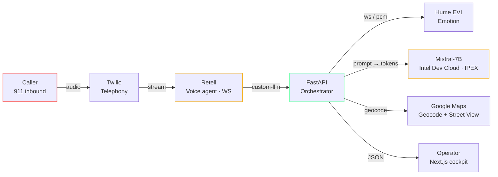

<div align="center">

# DispatchAI

### An empathetic AI dispatcher for 911 — real-time transcripts, emotion-aware triage, and a live operator cockpit.

[**Live case study & demo →&nbsp;dispatchai.art3m1s.me**](https://dispatchai.art3m1s.me)

[](https://devpost.com/software/dispatch-ai)
[](https://dispatchai.art3m1s.me)
[](https://www.youtube.com/watch?v=hdpdgxrilQM)

<a href="https://dispatchai.art3m1s.me">
  
</a>

</div>

---

## TL;DR

- **What:** A 911 dispatcher copilot. Caller phones a Twilio number, a Retell voice agent (running our custom LLM over websocket) handles the conversation while a fine-tuned Mistral-7B drafts incident reports and Hume EVI tracks the caller's emotional state. A Next.js operator cockpit gets the live transcript, severity-coded map pin, AI summary, and Street View — with a human dispatcher always in the loop on the actual response.
- **Why:** US 911 systems lose ~80% of staff within a year and are 30% understaffed. The agent does the parts a human shouldn't have to do at 3am — listen calmly to a panicking caller, type their address, score severity, and hand the human a tight, factual brief.
- **How fast:** 36 hours, 4 people, on‑site at the UC Berkeley AI Hackathon (Cal Hacks AI 2024 — 930 builders, 293 submissions).
- **Result:** **Grand prize** + Best use of Intel AI, LlamaIndex, Hume, and You.com. ~$64k in awarded prizes.

## Awards

| Award                                | Sponsor / Track   |
| ------------------------------------ | ----------------- |
| **Grand Prize**                      | UC Berkeley AI Hackathon 2024 |
| Best Use of Intel AI                 | Intel             |
| Best Use of LlamaIndex               | LlamaIndex        |
| Best Use of Hume EVI                 | Hume AI           |
| Best Use of You.com                  | You.com           |

## Live links

- **Live deployment / case study —** https://dispatchai.art3m1s.me
- **Devpost submission —** https://devpost.com/software/dispatch-ai
- **3-minute product demo —** https://www.youtube.com/watch?v=hdpdgxrilQM
- **Open-source model (Mistral-7B fine-tune, MIT) —** https://huggingface.co/spikecodes/ai-911-operator
- **Open-source dataset (518 transcripts) —** https://huggingface.co/datasets/spikecodes/911-call-transcripts
- **Design language doc —** [`Design.md`](./Design.md)

## What it does

1. **Real-time call handling.** Twilio → Retell websocket → custom LLM at FastAPI `/retell/llm-websocket/{call_id}`. Sub-second response latency on the conversational loop.
2. **Empathy as a first-class signal.** Hume EVI emotion telemetry feeds the LLM's context window so wording calibrates to the caller's distress, not just their words.
3. **AI-assisted triage, human-in-the-loop dispatch.** A fine-tuned Mistral-7B on Intel Dev Cloud drafts severity, title, summary, and recommendation; the operator can accept, edit, or reject. The AI never closes the loop alone.
4. **Operator cockpit.** Severity-coded incident queue, MapTiler map with synced pins, live transcript, caller emotion gauge, and pre-baked Google Street View — assembled from a single FastAPI orchestrator and 5 s polling.

## Architecture



The caller reaches Twilio; Retell runs the voice agent over a websocket against the FastAPI orchestrator. FastAPI streams audio to Hume EVI for emotion, prompts the Mistral-7B LoRA on Intel Dev Cloud, and pushes geocoded incidents to the Next.js operator cockpit. A human dispatcher remains the final authority on dispatch.

## Stack

| Layer                       | Tools |
| --------------------------- | ----- |
| Telephony                   | Twilio (inbound PSTN), Retell (voice agent + websocket transport) |
| Realtime LLM                | Custom LLM endpoint over websocket (`/retell/llm-websocket/{call_id}`) |
| Inference                   | Fine-tuned **Mistral 7B** (LoRA) hosted on **Intel Dev Cloud** with IPEX-LLM |
| Emotion                     | **Hume EVI** — streaming emotion telemetry |
| Orchestrator                | **FastAPI** + **Prisma (Python client)** + **PostgreSQL** |
| Frontend                    | **Next.js 16 (App Router)**, **TypeScript**, **TailwindCSS**, **shadcn/ui**, **Framer Motion**, **MapTiler / Leaflet** |
| Auth                        | **Clerk** (with phone-based dispatcher routing) |
| Maps & geocoding            | Google Maps API + Street View |
| Hosting                     | Backend on **Google Cloud Run** (`us-west1`); frontend on **Vercel** |
| Observability / dev tooling | Playwright MCP, React Grab MCP, Mermaid for system diagrams |

## Repository layout

```
.
├── client/                 # Next.js frontend (operator cockpit + portfolio case study)
│   ├── src/app/            # App Router routes; (layout) wraps the authed cockpit
│   ├── src/components/     # case-study/, dashboard/, header/, sidebar/, shared/, brand/
│   └── public/             # Static assets, team photos, pre-baked Street View
├── server/                 # FastAPI backend
│   ├── retell/             # Custom LLM websocket + Retell webhook
│   ├── analytics/          # Severity / title / summary / recommendation extraction
│   ├── geocoding/          # Google Maps + Street View
│   └── scripts/            # One-off ops scripts
├── prisma/                 # Shared Prisma schema (PostgreSQL)
├── intel_dev_cloud/        # Mistral-7B fine-tuning notebooks for Intel Dev Cloud
├── Dockerfile              # Cloud Run backend image
├── Design.md               # Full design language documentation
└── dispatch-ai-berkeley-hackathon-2024(-research).{json,md}
                            # Underlying research artifacts for the case study
```

## Team

Built at the UC Berkeley AI Hackathon, June 22–23, 2024.

- **[Spike Codes](https://github.com/spikecodes)** — model fine-tuning, dataset curation
- **[Bill Zhang](https://github.com/IdkwhatImD0ing)** — frontend, integration, portfolio cut
- **[Kevin Wu](https://github.com/Kevinw778)** — backend, geocoding, deployment
- **[Jasmine Wang](https://github.com/jas707)** — design, UX, product framing

## Build context & tradeoffs

This was a 36-hour build, not a shipping product. Things we'd do differently before any real PSAP deployment are written up in the [case study](https://dispatchai.art3m1s.me/#tradeoffs):

- The training snapshot is small (518 transcripts) and demographically uneven. Real deployment requires demographic-stratified evals against accents, dialects, and forms of distress not represented in 518 rows or in Hume's emotion model.
- The system is explicitly assist-only; recommendations carry a confidence score and the dispatcher accepts, edits, or rejects. No outbound dispatch is initiated by the AI.
- PSAPs need NENA / CJIS / SOC 2 alignment and integrations with legacy CAD and i3 NG911. The hackathon scope was deliberately a credible prototype, not a procurement-ready product.

The portfolio cut at [dispatchai.art3m1s.me](https://dispatchai.art3m1s.me) wraps the original system in a long-form case study — every page and feature still works, recruiters just don't have to sign in to see the cockpit (an embedded non-interactive replica is rendered on the case study page itself).

---

<details>
<summary><strong>Running it locally / operations notes</strong></summary>

### Backend runtime

The backend entrypoint is `server.main:app`.

```bash
uvicorn server.main:app --reload
```

Production runs on Google Cloud Run:

- Project: `spiritual-storm-469704-n2`
- Service: `dispatch`
- Region: `us-west1`
- Base URL: `https://dispatch-815644024160.us-west1.run.app`
- Cloud Run `status.url` alias: `https://dispatch-kkvf2gesjq-uw.a.run.app`
- Retell webhook: `https://dispatch-815644024160.us-west1.run.app/retell/webhook`
- Retell custom LLM websocket: `wss://dispatch-815644024160.us-west1.run.app/retell/llm-websocket`

### Required backend environment

Set these on Cloud Run before handling live calls:

- `DATABASE_URL`
- `OPENAI_API_KEY`
- `RETELL_API_KEY`
- `RETELL_AGENT_ID`
- `RETELL_PHONE_NUMBER`
- `RETELL_WEBHOOK_SECRET`
- `GOOGLE_API_KEY`
- `HUME_API_KEY`

Do not commit `.env` files. `.gcloudignore` excludes local environment files from source deploys.

To sync the local `server/.env` values into Cloud Run from PowerShell:

```powershell
$vars = @{}
Get-Content "server/.env" | ForEach-Object {
  if ($_ -match '^\s*([^#=]+)=(.*)$') {
    $key = $matches[1].Trim()
    $value = $matches[2].Trim().Trim('"')
    $vars[$key] = $value
  }
}

$envArg = '^|^DATABASE_URL=' + $vars['DATABASE_URL'] +
  '|OPENAI_API_KEY=' + $vars['OPENAI_API_KEY'] +
  '|RETELL_API_KEY=' + $vars['RETELL_API_KEY'] +
  '|RETELL_AGENT_ID=' + $vars['RETELL_AGENT_ID'] +
  '|RETELL_PHONE_NUMBER=' + $vars['RETELL_PHONE_NUMBER'] +
  '|RETELL_WEBHOOK_SECRET=' + $vars['RETELL_WEBHOOK_SECRET'] +
  '|GOOGLE_API_KEY=' + $vars['GOOGLE_API_KEY'] +
  '|HUME_API_KEY=' + $vars['HUME_API_KEY']

gcloud run services update dispatch `
  --project spiritual-storm-469704-n2 `
  --region us-west1 `
  --platform managed `
  --update-env-vars $envArg
```

The custom `^|^` delimiter avoids parsing failures for values that contain characters such as `&`.

### Deploy backend

Deploy from the repository root:

```bash
gcloud run deploy dispatch \
  --source . \
  --project spiritual-storm-469704-n2 \
  --region us-west1 \
  --platform managed \
  --allow-unauthenticated
```

The deploy uses:

- `Dockerfile` for the backend image.
- `.gcloudignore` to exclude the frontend, local virtualenvs, and secrets.
- Existing Cloud Run environment variables unless explicitly changed.

After deploy, verify the service:

```bash
gcloud run services describe dispatch \
  --project spiritual-storm-469704-n2 \
  --region us-west1 \
  --format="value(status.url,status.latestReadyRevisionName)"
```

The deploy command may print the canonical project-number URL (`https://dispatch-815644024160.us-west1.run.app`) while `status.url` may return the older `a.run.app` alias. Both route to the same Cloud Run service; Retell is configured to the canonical project-number URL.

### Retell agent configuration

The Retell agent should point to the Cloud Run backend, not an ngrok or Koyeb URL.

Use the SDK update shape below when changing the backend URL:

```python
import os
from dotenv import load_dotenv
from retell import Retell

load_dotenv("server/.env")

base_url = "https://dispatch-815644024160.us-west1.run.app"
websocket_url = base_url.replace("https://", "wss://") + "/retell/llm-websocket"
webhook_url = base_url + "/retell/webhook"

client = Retell(api_key=os.environ["RETELL_API_KEY"])
client.agent.update(
    os.environ["RETELL_AGENT_ID"],
    webhook_url=webhook_url,
    extra_body={
        "response_engine": {
            "type": "custom-llm",
            "llm_websocket_url": websocket_url,
        }
    },
)
```

Then confirm:

```python
agent = client.agent.retrieve(os.environ["RETELL_AGENT_ID"])
print(agent.response_engine)
print(agent.webhook_url)
```

Expected values:

- `response_engine.llm_websocket_url`: `wss://dispatch-815644024160.us-west1.run.app/retell/llm-websocket`
- `webhook_url`: `https://dispatch-815644024160.us-west1.run.app/retell/webhook`

### Call flow

1. Retell connects to `/retell/llm-websocket/{call_id}`.
2. The backend receives `call_details`, finds the registered user, creates a `Call`, and creates an empty `CallAnalytics` row.
3. Retell sends transcript updates through websocket messages.
4. The backend responds to the caller immediately, then runs analytics in the background.
5. Analytics updates `CallAnalytics` with severity, title, summary, recommendation, location, latitude, longitude, and Street View data when available.
6. The frontend polls `/api/calls` and reflects active call analytics on the dashboard map and detail panels.
7. The Retell webhook handles lifecycle events, especially `call_ended`, as a backup source of truth for resolving calls.

</details>
